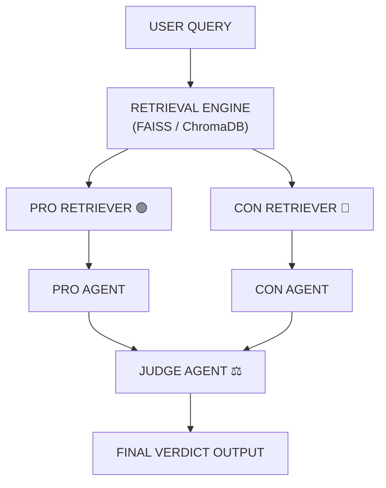

# ⚖️ VerdictAI – Adversarial RAG Debate System


---
## 🧠 Overview
**VerdictAI** is an **Adversarial Retrieval-Augmented Generation System** that transforms traditional AI answering into a **structured debate engine**.
Instead of producing a single response, it:
- 🟢 Builds a **Pro Argument (FOR)**
- 🔴 Builds a **Con Argument (AGAINST)**
- ⚖️ Uses a **Judge Agent** to evaluate both sides
- 🧠 Produces a **final AI verdict with reasoning**
👉 This system simulates real-world decision-making, debate, and critical reasoning.
---
## 🌍 Problem Statement
Most AI systems today:
- Give single-sided answers
- Hide uncertainty
- Lack reasoning transparency
- Fail to show opposing perspectives
---
## 🎯 Vision
> Build an AI system that thinks like a debate panel, not a chatbot.
Not one answer. Not one perspective.
👉 A structured reasoning engine that argues both sides before deciding.
---
## ⚡ Core Innovation
### 🧠 Adversarial Reasoning Engine
Instead of:
> Retrieve → Answer
We do:
> Retrieve → Debate → Evaluate → Decide
---
## 🏗️ System Architecture


---
## 📚 Data Pipeline
### 📥 Document Processing
- PDF / TXT / Web ingestion
- Semantic chunking (300–500 tokens)
- Overlap-based context preservation
---
### 🧠 Embedding Layer
- Sentence Transformers / OpenAI embeddings
- Semantic vector conversion
---
### 🗄️ Vector Database
- FAISS (fast similarity search)
- ChromaDB (optional)
---
## 🔍 Retrieval System
### 🟢 Pro Retrieval
- Benefits
- Advantages
- Supporting evidence
### 🔴 Con Retrieval
- Risks
- Limitations
- Counterarguments
---
## 🧠 AI Agent Layer
### 🟢 Pro Agent
Generates supporting arguments with evidence.
### 🔴 Con Agent
Generates opposing arguments with evidence.
### ⚖️ Judge Agent
Evaluates:
- Evidence quality
- Source relevance
- Logical reasoning
Outputs:
- Winner (PRO / CON / DRAW)
- Explanation
- Confidence score
---
## 📊 Output Format

PRO ARGUMENT:

* Key points with evidence

CON ARGUMENT:

* Counterpoints with evidence

JUDGEMENT:

* Winner: PRO / CON / DRAW
* Reasoning
* Confidence score (0–100)

---
## 🧪 Example Query
**Input:**
> Should AI be regulated?
**Output:**
- Pro argues safety and ethics
- Con argues innovation slowdown
- Judge selects best reasoning
---
## ⚙️ Tech Stack
- Python
- FastAPI (optional)
- FAISS / ChromaDB
- Sentence Transformers / OpenAI Embeddings
- NumPy
---
## 📁 Project Structure

```
adversarial-rag/
├── ingestion/
├── vectorstore/
├── retrieval/
├── agents/
├── prompts/
├── pipeline/
├── app/
├── data/
└── tests/
```
---
## 🔁 Workflow

```
User Query
   ↓
Retrieval Engine
   ↓
Pro / Con Split
   ↓
Pro Agent
   ↓
Con Agent
   ↓
Judge Agent
   ↓
Final Verdict
```
---
## 🧠 Key Innovations
- Dual-perspective reasoning
- Biased retrieval strategy
- Judge-based evaluation system
- Modular multi-agent design
---
## 📈 Why This Project Stands Out
- Multi-agent AI architecture
- Explainable AI reasoning
- Retrieval-augmented generation
- Structured debate system
---
## 🚀 Future Improvements
- Cross-encoder reranking
- Evidence contradiction detection
- Graph-based reasoning visualization
- Streaming debate UI
- Multi-judge voting system
---
## 🧪 Applications
- Policy analysis
- Legal reasoning
- Research validation
- Decision intelligence systems
---
## 🧠 Final Thought
> Not just answering questions — but reasoning through opposition before deciding.
---
## ⭐ Support
If you like this project, consider starring the repo ⭐
